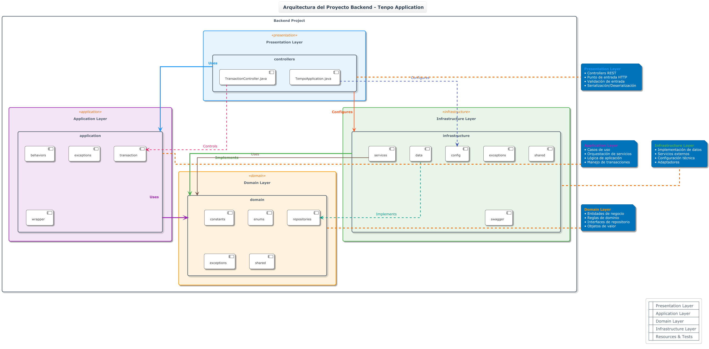
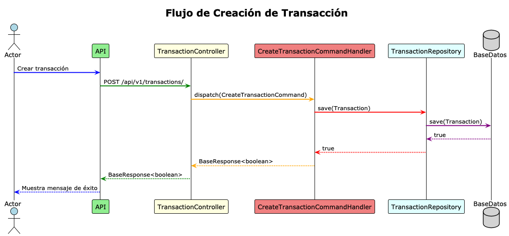
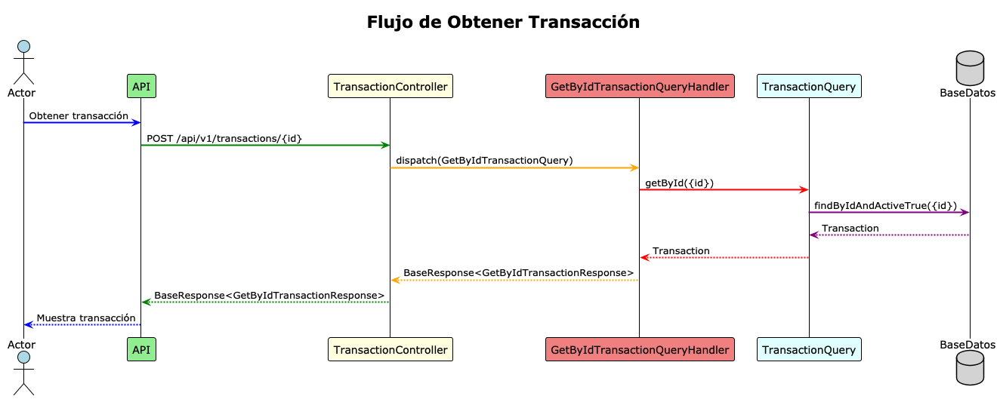

<div align="center">

  
  <h1>Tenpo Challenge - Ejecución con Docker</h1>
</div>

<br />

## Requisitos Previos
- Docker
- Docker Compose

## Ejecutar la Aplicación Docker Hub

- Crear archivo `docker-compose.yml`
```bash
version: '3'
services:
  frontend:
    image: abelmiraval/tenpo-springboot-react-frontend:latest
    ports:
      - "3000:80"
    depends_on:
      - backend

  backend:
    image: abelmiraval/tenpo-springboot-react-backend:latest
    ports:
      - "8080:8080"
    environment:
      SPRING_DATASOURCE_URL: jdbc:postgresql://postgres:5432/tenpo_db
      SPRING_DATASOURCE_USERNAME: tenpo_user
      SPRING_DATASOURCE_PASSWORD: tenpo_password
    depends_on:
      - postgres

  nginx:
    image: abelmiraval/tenpo-springboot-react-nginx:latest
    ports:
      - "80:80"
    depends_on:
      - frontend

  postgres:
    image: postgres:15
    environment:
      POSTGRES_DB: mydb
      POSTGRES_USER: myuser
      POSTGRES_PASSWORD: mypass
    ports:
      - "5432:5432"
    volumes:
      - pgdata:/var/lib/postgresql/data

volumes:
  pgdata:

```

## Ejecutar la Aplicación Local


### Opción 1: Comando Único

```bash
docker-compose up --build
```

### Opción 3: Paso a Paso
```bash
# 1. Construir imágenes
docker-compose build

# 2. Iniciar servicios
docker-compose up -d

# 3. Ver logs (opcional)
docker-compose logs -f
```

## Acceder a la Aplicación
- **Frontend**: http://localhost:3000
- **Backend API**: http://localhost:8080/api
- **Base de Datos**: localhost:5432

## Detener la Aplicación
```bash
docker-compose down
```

## Limpiar Todo (incluye datos)
```bash
docker-compose down -v
docker system prune -f
```

## Verificar que Funciona
```bash
# Ver estado de contenedores
docker-compose ps

# Probar backend
curl http://localhost:8080/api/health

# Probar frontend
curl http://localhost:3000
```

## Estructura de Servicios
- **database**: PostgreSQL 15
- **backend**: Spring Boot (Java 21)
- **frontend**: React + Vite + Nginx

## Troubleshooting
Si hay problemas de puertos ocupados:
```bash
# Verificar puertos
sudo lsof -i :3000
sudo lsof -i :8080
sudo lsof -i :5432

# Detener servicios que usen esos puertos
```


## Diagrama de software

### Diagrama de componentes




### Diagrama de secuencia 

### Crear transacción


### Obtener transaccion
